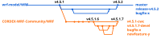

# CORDEX WRF Community (CWC) WRF code #

This is a fork of the official code repository for the [Weather Research & Forecasting (WRF)](https://github.com/wrf-model/WRF) modelling system.
CORDEX-WRF-Community (CWC) WRF versions are tagged with an additional number (e.g. [v4.5.1.6](https://github.com/CORDEX-WRF-community/WRF/releases/tag/v4.5.1.6)), indicating our modifications with respect to an official release (e.g. v4.5.1), which might include bugfixes not yet included in the official release or new features used by some CORDEX initiatives.
Discussion occurs as issues in the specific repositories for the different initiatives.
WRF development is done via pull requests to the next CWC WRF development branch (currently **v4.5.1.7-devel**).
The latest CWC WRF release (currently **v4.5.1.6**) is always found in branch **v4.5.1-cwc**, or the corresponding base version.
Releases are issued for specific purposes; e.g. when a new experiment is started for a given CORDEX initiative.
Check out the repository of the corresponding initiative to find out which model version to use for each experiment and the specific configuration files (namelists, TBL files, etc).

## Original WRF README.md ##

### WRF-ARW Modeling System  ###

We request that all new users of WRF please register. This allows us to better determine how to support and develop the model. Please register using this form:[https://www2.mmm.ucar.edu/wrf/users/download/wrf-regist.php](https://www2.mmm.ucar.edu/wrf/users/download/wrf-regist.php).

For an overview of the WRF modeling system, along with information regarding downloads, user support, documentation, publications, and additional resources, please see the WRF Model Users' Web Site: [https://www2.mmm.ucar.edu/wrf/users/](https://www2.mmm.ucar.edu/wrf/users/).
 
Information regarding WRF Model citations (including a DOI) can be found here: [https://www2.mmm.ucar.edu/wrf/users/citing_wrf.html](https://www2.mmm.ucar.edu/wrf/users/citing_wrf.html).

The WRF Model is open-source code in the public domain, and its use is unrestricted. The name "WRF", however, is a registered trademark of the University Corporation for Atmospheric Research. The WRF public domain notice and related information may be found here: [https://www2.mmm.ucar.edu/wrf/users/public.html](https://www2.mmm.ucar.edu/wrf/users/public.html).

